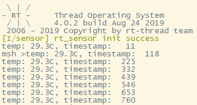

# DS18B20 数字温度传感器

## 软件包简介

DS18B20是常用的数字温度传感器，其输出的是数字信号，具有体积小，硬件开销低，抗干扰能力强，精度高的特点。DS18B20数字温度传感器接线方便，封装成后可应用于多种场合，如管道式，螺纹式，磁铁吸附式，不锈钢封装式，型号多种多样，有LTM8877，LTM8874等等。

该软件包已对接了 RT-Thread Sensor 框架的 DS18B20 驱动程序。

## 运行结果

FinSH 控制台输出信息如下：

## 注意事项

DS18B20 是采用单总线通讯的传感器，本软件包采用 GPIO 模拟单总线时序。DS18B20 的读写数据要求比较严格，且时间不短，故无法使用关中断或者关调度的方式实现独占 CPU 以保证时序完整正确，即有可能被系统的线程调度时打断其时序，因此可能出现读取数据失败的情况，请用户注意。

## 联系人信息

- 维护者：[WillianChan](https://github.com/willianchanlovegithub)
- 主页：https://github.com/willianchanlovegithub/ds18b20